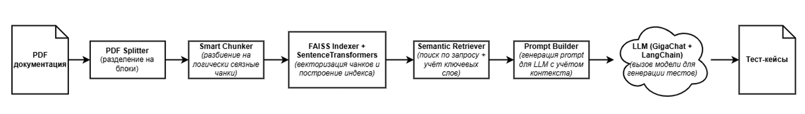

# Bugsy

**Bugsy** — это экспериментальный проект, часть курсовой работы, направленный на генерацию промптов и тестов на основе технической документации. Исследуются различные подходы к обработке документа, включая:


- Семантический поиск по документации с использованием FAISS и SentenceTransformers (all-MiniLM-L6-v2)
- "Умный" чанкинг текста + фильтрация по ключевым словам
- Генерация промптов для LLM с учётом контекста документа
- Генерация UI-тестов по готовому сценарию (через GigaChat / LangChain)
- Поддержка эквивалентностного тест-дизайна, граничных и негативных кейсов
- Отдельные пайплайны: DOM-анализ, compacting, chunk-based генерация 



## Статус

На текущем этапе реализованы:
- Скрипты для извлечения и предобработки документации
- Несколько методов генерации промптов на основе chunk'ов
- Эксперименты с DOM-компактингом и фильтрацией
- Интеграция LangChain (не входит в код проекта) для генерации тестов

Сгенерированные тест-кейсы находятся в папке [`data/results`](data/results) в generated_test_cases_UX_<N>.md файлах (где <N> — порядковый номер сценария), промпты в соответствующих - generated_prompt_UX_<N>.txt файлах. Генерация производилась с помощью **GigaChat** через LangChain, однако код не включён в проект по соображениям конфиденциальности аккаунта.

## Установка

1. Клонируйте проект, создайте виртуальное окружение и установите зависимости:

```bash
git clone https://github.com/your-username/bugsy_2025.git
cd bugsy_2025
python -m venv venv
source venv/bin/activate  # или .\\venv\\Scripts\\activate на Windows
pip install -r requirements.txt
```

2. (Опционально) Настройте Jupyter для работы с окружением:

```bash
python -m ipykernel install --user --name=venv --display-name "Python (venv)"
```

## Использование

Запуск основных скриптов:

```bash
python run_extract_dom.py        # Извлечение DOM из HTML
python run_compact_dom.py        # Компактный DOM
python run_smart_chunker.py      # Разделение текста на chunk'и
python run_split.py              # Разделение PDF на страницы/блоки
```

Jupyter-ноутбук для генерации промптов и анализа:  
- [`notebooks/prompt_generation.ipynb`](notebooks/prompt_generation.ipynb)    

## Структура проекта

- `src/` — основной код проекта, разделён по модулям:
  - `dom/` — обработка DOM-дерева
  - `parser/` — парсинг и разбиение документа
  - `generator/` — генерация промптов
  - `retriever/` — поиск по эмбеддингам
  - `indexer/` — FAISS-индексация

- `data/` — документация, промежуточные данные и результаты
- `embeddings/` — сохранённые эмбеддинги и индексы
- `run_*.py` — скрипты запуска пайплайнов

## Текущие результаты

Сгенерированные:
- **тест-кейсы** — `data/results/generated_test_cases_UX_<N>.md`
- **промпты** — `data/results/generated_prompt_UX_<N>.txt`